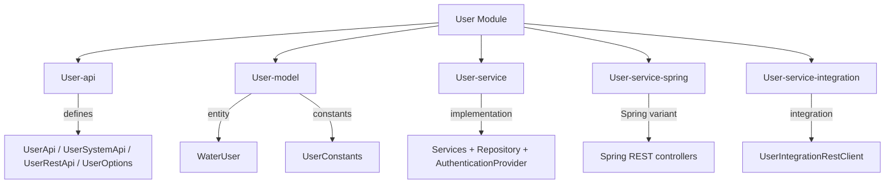
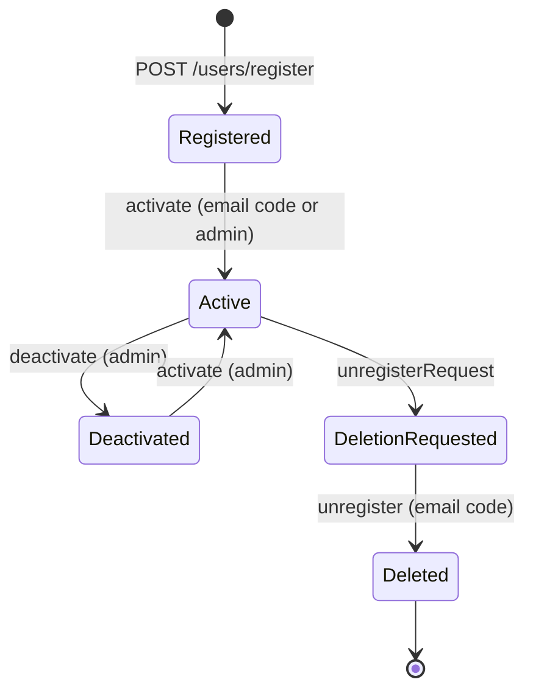

# User Module

The **User** module provides a complete user management system for the Water Framework. It handles user registration, activation/deactivation, password reset, account deletion, and user lifecycle — but intentionally **does not include login**. Authentication is a separate responsibility handled by the Authentication module.

## Architecture Overview



## Sub-modules

| Sub-module | Description |
|---|---|
| **User-api** | Defines `UserApi`, `UserSystemApi`, `UserRestApi`, `UserRepository`, and `UserOptions` interfaces |
| **User-model** | Contains `WaterUser` JPA entity, `UserConstants`, and `UserActions` |
| **User-service** | Service implementations, repository, REST controller, and `UserAuthenticationProvider` |
| **User-service-spring** | Spring MVC REST controllers and Spring Boot application |
| **User-service-integration** | REST-based integration client for cross-service user operations |

## WaterUser Entity

```java
@Entity
@Table(name = "w_user",
    uniqueConstraints = {
        @UniqueConstraint(columnNames = {"username"}),
        @UniqueConstraint(columnNames = {"email"})
    })
@AccessControl(
    availableActions = { CrudActions.SAVE, CrudActions.REMOVE, CrudActions.FIND, CrudActions.FIND_ALL,
                         CrudActions.UPDATE, UserActions.IMPERSONATE, UserActions.ACTIVATE, UserActions.DEACTIVATE },
    rolesPermissions = {
        @DefaultRoleAccess(roleName = "userManager", actions = { "save","remove","find","find_all","update","impersonate","activate","deactivate" }),
        @DefaultRoleAccess(roleName = "userViewer", actions = { "find","find_all" }),
        @DefaultRoleAccess(roleName = "userEditor", actions = { "save","find","find_all","update" })
    })
public class WaterUser extends AbstractJpaExpandableEntity implements ProtectedEntity, User { }
```

### Entity Fields

| Field | Type | Constraints | JSON View | Description |
|---|---|---|---|---|
| `name` | String | `@NotNull`, `@NoMalitiusCode`, max 500 | Extended | First name |
| `lastname` | String | `@NotNull`, `@NoMalitiusCode`, max 500 | Extended | Last name |
| `username` | String | `@NotNull`, `@NoMalitiusCode`, unique, alphanumeric | Extended | Login identifier |
| `password` | String | `@NotNull`, `@ValidPassword` | Write-only | Hashed password |
| `salt` | String | — | Hidden | Password salt |
| `email` | String | `@Email`, `@NotNull`, unique | Extended | Email address |
| `admin` | boolean | Default `false` | Compact (read-only) | Admin flag |
| `active` | boolean | Default `false` | Internal | Account active status |
| `deleted` | boolean | Default `false` | Internal | Logical deletion flag |
| `imagePath` | String | `@NoMalitiusCode` | Extended | User avatar path |
| `activateCode` | String | — | Hidden | Email activation code |
| `passwordResetCode` | String | — | Hidden | Password reset code |
| `deletionCode` | String | — | Hidden | Account deletion code |
| `roles` | Set\<Role\> | Transient | Hidden | User's roles (loaded at runtime) |

`WaterUser` extends `AbstractJpaExpandableEntity`, meaning developers can add dynamic fields at runtime.

## User Actions

Beyond standard CRUD, the module defines custom actions:

| Action | Description |
|---|---|
| `UserActions.IMPERSONATE` | Impersonate another user |
| `UserActions.ACTIVATE` | Activate a user account |
| `UserActions.DEACTIVATE` | Deactivate a user account |

## Default Roles

| Role | Permissions |
|---|---|
| **userManager** | `save`, `update`, `find`, `find_all`, `remove`, `impersonate`, `activate`, `deactivate` |
| **userViewer** | `find`, `find_all` |
| **userEditor** | `save`, `update`, `find`, `find_all` |

## User Lifecycle



## API Interfaces

### UserApi (Public — with permission checks)

Extends `BaseEntityApi<WaterUser>`, plus:

| Method | Description |
|---|---|
| `register(WaterUser)` | Register a new user (sends activation email) |
| `activate(String email, String code)` | Activate via email confirmation code |
| `activate(long userId)` | Activate by admin |
| `deactivate(long userId)` | Deactivate by admin |
| `findByUsername(String)` | Find user by username |
| `passwordResetRequest(String email)` | Start password reset (sends email with code) |
| `resetPassword(email, code, password, confirm)` | Complete password reset |
| `changePassword(userId, oldPwd, newPwd, confirm)` | Change password (logged-in user) |
| `updateAccountInfo(WaterUser)` | Update name, lastname, email, username |
| `unregisterAccountRequest()` | Start account deletion (sends email with code) |
| `unregister(String email, String code)` | Complete account deletion |
| `findAllDeleted(delta, page, filter, order)` | Find logically deleted users |
| `countAllDeleted(Query)` | Count deleted users |

### UserSystemApi (System — no permission checks)

Same capabilities plus:

| Method | Description |
|---|---|
| `findByEmail(String)` | Find user by email |
| `changeDeletionCode(String)` | Update deletion code for logged-in user |
| `changePassword(WaterUser, password, confirm)` | Change password without old password check |

### REST Endpoints

| HTTP Method | Path | Auth | Description |
|---|---|---|---|
| `POST` | `/water/users` | `@LoggedIn` | Create user (admin) |
| `PUT` | `/water/users` | `@LoggedIn` | Update user |
| `GET` | `/water/users/{id}` | `@LoggedIn` | Find user by ID |
| `GET` | `/water/users` | `@LoggedIn` | Find all users |
| `DELETE` | `/water/users/{id}` | `@LoggedIn` | Remove user |
| `POST` | `/water/users/register` | Public | Self-registration |
| `PUT` | `/water/users/activate?email=&activationCode=` | Public | Activate via email code |
| `PUT` | `/water/users/{id}/activate` | `@LoggedIn` | Activate by admin |
| `PUT` | `/water/users/{id}/deactivate` | `@LoggedIn` | Deactivate by admin |
| `PUT` | `/water/users/resetPasswordRequest?email=` | Public | Request password reset |
| `POST` | `/water/users/unregisterRequest` | `@LoggedIn` | Request account deletion |
| `DELETE` | `/water/users/unregister?email=&deletionCode=` | `@LoggedIn` | Confirm account deletion |

## Configuration

| Property | Description | Default |
|---|---|---|
| `it.water.user.registration.enabled` | Enable/disable self-registration | `true` |
| `it.water.user.activation.url` | Frontend/backend activation URL | — |
| `it.water.user.password.reset.url` | Frontend/backend password reset URL | — |
| `it.water.user.admin.default.password` | Default admin password | — |
| `it.water.user.physical.deletion.enabled` | Physical vs logical deletion | `false` |
| `it.water.user.registration.email.template.name` | Email template name for registration | `null` (uses default) |

## Email Integration

The User module requires two external services to be registered in the runtime:

1. **`EmailNotificationService`** — Sends registration, activation, password reset, and deletion confirmation emails
2. **`EmailContentBuilder`** — Builds email content from templates

Both interfaces are provided by the `EMail` module, but can be implemented independently to integrate with existing email systems.

## Usage Example

```java
@Inject
private UserApi userApi;

// Register a new user
WaterUser user = new WaterUser("John", "Doe", "johndoe", "P@ssw0rd!", salt, "john@example.com");
user.setPasswordConfirm("P@ssw0rd!");
userApi.register(user);

// Activate after email confirmation
userApi.activate("john@example.com", activationCode);

// Password reset flow
userApi.passwordResetRequest("john@example.com");
// ... user receives email with reset code ...
userApi.resetPassword("john@example.com", resetCode, "NewP@ss1!", "NewP@ss1!");

// Admin operations
userApi.deactivate(userId);
userApi.activate(userId);
```

## Dependencies

- **Core-api** — Base interfaces (`BaseEntityApi`, `BaseEntitySystemApi`, `User`)
- **Core-model** — `AbstractJpaExpandableEntity`, `ProtectedEntity`
- **Core-security** — `@AccessControl`, `@DefaultRoleAccess`, security annotations
- **Core-validation** — `@NoMalitiusCode`, `@NotNullOnPersist`, `@ValidPassword`
- **Permission** — Permission system
- **Role** — Role management
- **EMail** — Email sending for registration/activation/reset flows
- **Rest** — REST controller infrastructure
